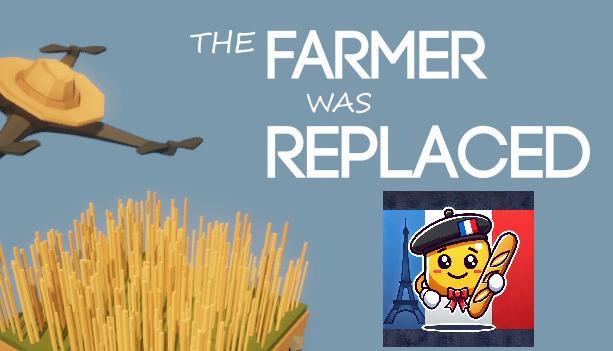

# README: The Farmer Was Replaced: French Translation Project



## Project Overview
This project focuses on translating the game **[The Farmer Was Replaced](https://store.steampowered.com/app/2060160/The_Farmer_Was_Replaced/)** from English to French. The game involves programming and automating a drone to optimize farming tasks using a Python-like language.

## Features
- **Automatic Translation**: Translates in-game text files (`.txt`, `.md`) to French while preserving structure.
- **Customizable Prompts**: Supports specific translation prompts for each file type.
- **Error Handling**: Logs errors during translation and handles edge cases.

## Requirements
- `Python 3.8+`
- `openai`, `pyyaml`, `tqdm`

## Setup
1. Purchase and install the game from [Steam](https://store.steampowered.com/app/2060160/The_Farmer_Was_Replaced/). The game is a fantastic tool for learning how to code, and it's through projects like these that the passion for programming can be shared and nurtured.
2. Clone the repository.
3. Install dependencies: `pip install -r requirements.txt`.
4. Add your OpenAI API key to `config.yaml`.

## Usage
Run the translation script:
```bash
python main.py
```

## Installation of the Translation
1. Navigate to the game's language folder: 
   ```bash
   SteamLibrary\steamapps\common\The Farmer Was Replaced\TheFarmerWasReplaced_Data\StreamingAssets\Languages
   ```
2. Copy the generated `FR` folder from the script into this directory.

## Enabling the Translation
1. Download **dnSpy** from [GitHub](https://github.com/dnSpy/dnSpy/releases).
2. Launch **dnSpy** and open the following file:
   ```bash
   SteamLibrary\steamapps\common\The Farmer Was Replaced\TheFarmerWasReplaced_Data\Managed\Utils.dll
   ```
3. Search for the class `Localizer`.
4. Right-click on the class and choose **Edit Class**.
5. Replace the lines `Localizer.LoadLang("EN")` with `Localizer.LoadLang("FR")` at line 19 and 71.
6. Press **F6** to compile the modifications.
7. Save the changes and close **dnSpy**.

## Launch the Game
Start the game, and it should now be displayed in French!

## Contribution
Feel free to contribute or report issues.

---

Est-ce que cela correspond mieux ?